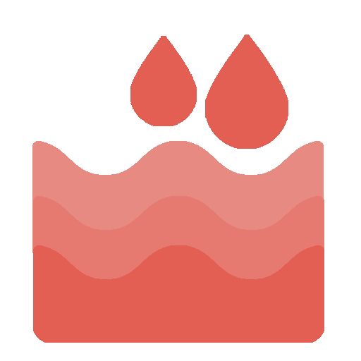

<br>
# 2DWater
<i>Interactive 2D water for Sprites and Tiled Backgrounds with ripples, auto-waves, Physics splashes, buoyancy controls, and live surface queries.</i> <br>
### Version 1.1.3.0

[](https://github.com/SalmanShhh/2dwater/releases/download/salmanshh_2dwater-1.1.3.0.c3addon/salmanshh_2dwater-1.1.3.0.c3addon)
<br>
<sub> [See all releases](https://github.com/SalmanShhh/2dwater/releases) </sub> <br>

#### What's New in 1.1.3.0
- **Added:** - Added "Max Wave Height" cap

<sub>[View full changelog](#changelog)</sub>

---
<b><u>Author:</u></b> SalmanShh <br>
<sub>Made using [CAW](https://marketplace.visualstudio.com/items?itemName=skymen.caw) </sub><br>

## Table of Contents
- [Usage](#usage)
- [Examples Files](#examples-files)
- [Properties](#properties)
- [Actions](#actions)
- [Conditions](#conditions)
- [Expressions](#expressions)
---
## Usage
To build the addon, run the following commands:

```
npm i
npm run build
```

To run the dev server, run

```
npm i
npm run dev
```

## Examples Files
| Description | Download |
| --- | --- |
| 2D Water Example | [](https://github.com/SalmanShhh/2dwater/raw/refs/heads/main/examples/2D%20Water%20Example.c3p) |

---
## Properties
| Property Name | Description | Type |
| --- | --- | --- |
| Tension | Spring stiffness pulling each column toward its rest height. Low values produce slow, wide waves. High values produce tight, fast ripples. | float |
| Dampening | Energy decay per tick. High values produce thick, viscous water. Low values allow long oscillation. | float |
| Spread | Lateral propagation rate between adjacent columns. Controls how fast a disturbance travels horizontally. | float |
| Mesh Columns | Number of simulation columns and mesh control points on the top row. Minimum 2, clamped at init. Can be changed at runtime via SetMeshColumns. | integer |
| Mesh Rows | Number of mesh rows. Only row 0 (the top edge) is deformed by the simulation. Minimum 2, clamped at init. | integer |
| Enable Auto-Waves | Continuously drives sinusoidal surface motion without any ApplyForce calls. When enabled, idle detection is bypassed. | check |
| Wave Length | Spatial wavelength of auto-waves in pixels. | integer |
| Period | Time in seconds for one full auto-wave cycle. Setting to 0 freezes phase accumulation. | float |
| Magnitude | Amplitude of auto-waves in pixels above the rest surface. | integer |
| Auto Physics Splash | When enabled, automatically applies a splash impulse when a Physics-behavior instance overlaps the water object. You can exclude specific instances from auto-splash with the ClearInstanceSplashSetting action. | check |
| Physics Splash Force Multiplier | Scales the impacting instance's velocityY to a splash force magnitude. | float |
| Physics Splash Surface Radius | Horizontal splash radius in pixels for Physics auto-impacts. | integer |
| Idle Threshold | Maximum absolute column speed below which the simulation is considered at rest and ticking halts. 0 disables idle detection. Isn't used when Auto-Waves is enabled. | float |
| Spread Pass Count | Number of lateral spread iterations per tick. Min 1, max 16. Reduce for background water. | integer |
| Enabled | Whether the water behavior is active. When disabled, the simulation is paused. | check |
| Max Wave Height | Caps how far the surface may displace from rest, in pixels, in either direction (peak height and trough depth). Prevents extreme spikes from large splash forces. Set to 0 to disable the cap. If using Auto-Waves, set this to 0 or to at least the wave Magnitude to avoid clipping the waves flat. | float |


---
## Actions
| Action | Description | Params
| --- | --- | --- |
| Set mesh columns | Changes the number of simulation columns at runtime. Wave state is resampled. Do not call every tick. | Columns             *(number)* <br> |
| Set mesh rows | Changes the number of mesh rows at runtime. Column simulation state is preserved. Do not call every tick. | Rows             *(number)* <br> |
| Set fixed simulation step | Sets the fixed simulation step in seconds. Clamped to [1/240FPS, 1/15FPS]. | Seconds             *(number)* <br> |
| Set idle threshold | Sets the idle detection speed threshold at runtime. 0 disables idle detection. | Threshold             *(number)* <br> |
| Set max simulation steps per tick | Sets the maximum fixed simulation steps processed per tick. Clamped to [1, 20]. Higher values recover from hitches better but can increase per-frame cost. | Steps             *(number)* <br> |
| Set off-screen auto-wave lightweight mode | Performance saver for off-screen water with auto-waves. When enabled, the behavior only advances wave phase and reconstructs the surface directly, skipping spring/spread simulation. Trade-off: hidden ripple dynamics and force interactions are not simulated while this mode is active. | Enabled             *(boolean)* <br> |
| Set spread pass count | Sets the number of spread pass iterations per tick. Clamped to [1, 16]. | Count             *(number)* <br> |
| Apply splash force | Applies a vertical impulse to the water surface at a world X coordinate. Does not require any object or Physics behavior — use this to manually trigger splashes from events or script. | X             *(number)* <br>Force             *(number)* <br>Radius             *(number)* <br> |
| Clear instance splash setting | Removes the per-instance override for the chosen setting, falling back to the object-type override or water default. Only relevant if the instance has the Physics behavior attached. | UID             *(number)* <br>Setting             *(combo)* <br> |
| Clear object-type splash setting | Removes the object-type override for the chosen setting, reverting to the water default. Only relevant for objects that have the Physics behavior attached. | Object type             *(object)* <br>Setting             *(combo)* <br> |
| Set default splash setting | Sets the water-wide fallback value for a splash setting. Applies to all objects with the Physics behavior that enter the water, unless overridden per object type or per UID. | Setting             *(combo)* <br>Value             *(number)* <br> |
| Set instance splash setting | Overrides a splash setting for a single instance by UID. Only affects the instance if it has the Physics behavior attached. Takes priority over any object-type or water default. | UID             *(number)* <br>Setting             *(combo)* <br>Value             *(number)* <br> |
| Set object-type splash setting | Overrides a splash setting for all instances of the chosen object type. Only affects objects that have the Physics behavior attached. Takes priority over the water default but can be overridden per UID. | Object type             *(object)* <br>Setting             *(combo)* <br>Value             *(number)* <br> |
| Set physics auto-splash enabled | Enables or disables automatic splash detection. When enabled, the water monitors all objects with the Physics behavior and creates splashes when they enter or exit the water surface. Objects must have the Physics behavior attached to be detected. | Enabled             *(boolean)* <br> |
| Flatten surface | Instantly moves the current surface toward flat by a percentage. 100 fully flattens it; 0 leaves it unchanged. | Percentage             *(number)* <br> |
| Set dampening | Sets the energy decay rate at runtime. | Dampening             *(number)* <br> |
| Set enabled | Enables or disables the water behavior. When disabled, the simulation is paused and ticking stops. | Enabled             *(boolean)* <br> |
| Set spread | Sets the lateral propagation rate at runtime. | Spread             *(number)* <br> |
| Set tension | Sets the spring constant at runtime. | Tension             *(number)* <br> |
| Set auto-waves enabled | Enables or disables auto-wave oscillation. | Enabled             *(boolean)* <br> |
| Set magnitude | Sets the auto-wave amplitude in pixels. | Magnitude             *(number)* <br> |
| Set max wave height | Caps how far the surface may displace from rest, in pixels, in either direction. Prevents extreme spikes from large splash forces. Set to 0 to disable the cap. | Max wave height             *(number)* <br> |
| Set period | Sets the auto-wave cycle duration in seconds. 0 freezes phase accumulation. | Period             *(number)* <br> |
| Set wave length | Sets the spatial wavelength of auto-waves in pixels. | Wave Length             *(number)* <br> |


---
## Conditions
| Condition | Description | Params
| --- | --- | --- |
| On Physics impact | Fires once per Physics instance per surface zone entry. Pass 0 to fire for any impacting instance. | Instance UID *(number)* <br> |
| Is auto-waves enabled | True if auto-wave oscillation is currently active. |  |
| Is enabled | True if the water behavior is currently enabled. |  |
| Is idle | True if the simulation has stopped ticking due to idle detection. |  |
| Is Physics auto-force enabled | True if Physics auto-force detection is currently active. |  |


---
## Expressions
| Expression | Description | Return Type | Params
| --- | --- | --- | --- |
| ImpactForce | The computed force applied to the surface. Valid inside OnPhysicsImpact only. | number |  | 
| ImpactUID | UID of the impacting Physics instance. Valid inside OnPhysicsImpact only. | number |  | 
| ImpactX | World X coordinate of the Physics impact. Valid inside OnPhysicsImpact only. | number |  | 
| MeshColumns | Current number of simulation columns. | number |  | 
| MeshRows | Current number of mesh rows. | number |  | 
| FixedSimStep | Current fixed simulation step in seconds. | number |  | 
| MaxSimStepsPerTick | Current max fixed simulation steps processed per tick. | number |  | 
| InstanceSplashValue | Returns the effective splash setting value for the given UID, resolving UID override first, then object-type override, then water default. Does not require the Physics behavior to query. | number | UID *(number)* <br>Setting *(string)* <br> | 
| ObjectTypeSplashValue | Returns the effective splash setting value for the given object type (or its name), applying the object-type override if set, then falling back to the water default. Does not require the Physics behavior to query. | number | Object type *(any)* <br>Setting *(string)* <br> | 
| AutoWaveEnabled | 1 if auto-waves are currently enabled, 0 if disabled. | number |  | 
| SurfaceNormal | Upward surface normal angle in radians for the water surface at world X position x. | number | X *(number)* <br> | 
| SurfaceNormalAngle | Upward surface normal angle in degrees from 0 to 360 for the water surface at world X position x. | number | X *(number)* <br> | 
| SurfaceY | World Y of the water surface at world X position x. | number | X *(number)* <br> | 
| MaxWaveHeight | Current max wave height cap in pixels (displacement from rest, either direction). 0 means the cap is disabled. | number |  | 


---
## Changelog

**1.1.3.0**
- **Added:** - Added "Max Wave Height" cap

**1.1.2.0**
- **Fixed:** - Restart crash bug around the Physics velocity read

**1.1.1.0**
- **Added:** - Added Enabled property to Properties
- **Added:** - Added ACE for Toggling whether Behaviour is enabled. (pauses if disabled)
- **Added:** - can also be toggled in the Debugger.

**1.1.0.0**
- **Added:** - Added ACEs for off-screen auto-wave lightweight mode (toggle) with debugger support.
- **Fixed:** - made sure the water simulation is framerate independent.

**1.0.1.0**
- **Fixed:** - made sure only 1 instance of the behaviour is allowed on an object.

**1.0.0.0**
- **Added:** initial release candidate
- **Fixed:** - add icon

**0.3.0.0**

**0.2.1.0**

**0.2.0.0**
- **Added:** - Add Bouyancy System

**0.1.1.0**

**0.1.0.0**
- **Added:** initial test build

**0.0.0.0**
- **Added:** Initial release.
